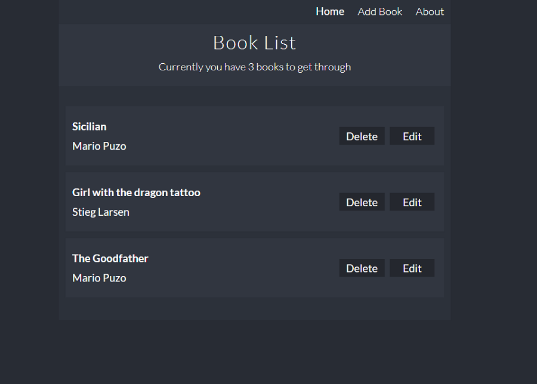

# Book List in React

Book List is a create react app. It was created for mobile and desktop views. It is possible to
add new books, remove or edit books which are already displayed. Program also add books to localstorage

## Tools & Technology used

- Visual Studio Code
- React
- JSX
- SCSS
- UUID
- ContextAPI
- Hooks (useState, useEffect, useReducer)
